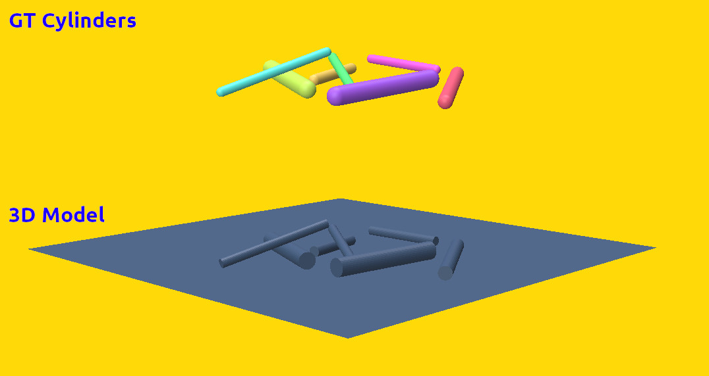

# blender_cylinder_generator
Small blender script, that allows to generate quick and random cylinder layouts, that are simulated physically. Primary intention of this is Dataset Generation for 3D Vision Tasks.

## Usage

⚠️ Blender 4.0 is required, other versions are untested! ⚠️
 

#### Dataset Creation
```
mkdir output
blender CylinerGen.blend --background --python blender_gen.py -- <Number of Generations> <Output Folder> 
```

#### Dataset Visualization
```
python viz.py <Data Folder>
```

#### Output



The output folder contains 2 files:
- OBJ File of Scene
- Json Ground Truth for Cylinders
  - Example: 
    ```
    [
        {
            "name": "Cylinder_0",
            "length": 4.55350050175778,
            "radius": 0.368228632332338,
            "end_endpoints": [
                [-0.3308, 0.3664, -1.1038],
                [0.6314, 0.3664, 3.3468]
            ]
        }, 
        ...
    ]

